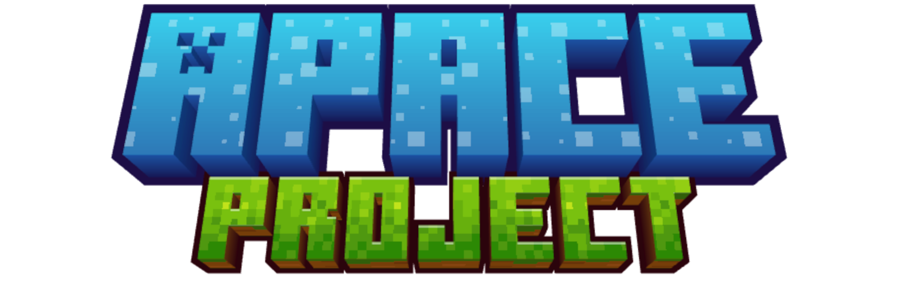

<p align="center">
  
</p>

<p align="center">
  <a href="./LICENSE"></a>
  
</p>

Really fast replacement server for Minecraft Earth™, based on [Solace](https://github.com/Earth-Restored/Solace) with additional features and fixes.

> [!NOTE]
> **Active development.** Server is functional — maps, buildplates, challenges, daily rewards, adventures, crafting, and more are working. Performance improvements planned.

> [!TIP]
> ### :zap: Dev branch news — v2 persistent server
>
> I've done some math: on my configuration, **Apace `dev` loads buildplates 3471% faster than Solace/Apace `main`** — the wait time is reduced by **97.2%**. Isn't that crazy?
>
> Instead of booting a whole new Minecraft server per buildplate, `dev` runs **one persistent Fabric server** hosting every buildplate as an on-demand dimension (created in ~1s, world data imported/exported on the fly). It will land in the `main` branch soon.
>
> We are millimeters (McDonald's sauces, for our fellow American friends) away from actually releasing this — the bugs that came with the dev branch and made buildplates **100% air** have been fixed (world data is now really imported on join and saved on leave).

## Disclaimer

**Apace** is an independent, community-driven project and is **not affiliated with, authorized, maintained, endorsed, or sponsored** by Microsoft Corporation, Mojang Studios, or any of their affiliates or subsidiaries.

* *Minecraft Earth™* is a trademark of Microsoft Corporation. All trademarks and registered trademarks are the property of their respective owners.
* This project does not distribute, host, or provide access to original game assets, proprietary binaries, or resource packs. Users are responsible for providing their own legally obtained assets.
* This software is provided solely for educational, research, and archival purposes to restore functionality to a discontinued service.
* This project is provided "as-is" without any warranty of any kind, express or implied. In no event shall the authors be held liable for any claim, damages, or other liability.

## Features

| Feature       | Status             | Notes                                                                                    |
|---------------|--------------------|------------------------------------------------------------------------------------------|
| Map           | :white_check_mark: |                                                                                          |
| Profile       | :construction:     | Loads, can view activity log/settings, cannot change skin, statistics not implemented    |
| Journal       | :white_check_mark: |                                                                                          |
| Activity Log  | :white_check_mark: |                                                                                          |
| Inventory     | :white_check_mark: |                                                                                          |
| Crafting      | :white_check_mark: |                                                                                          |
| Smelting      | :white_check_mark: |                                                                                          |
| Boosts        | :white_check_mark: |                                                                                          |
| Boost Minis   | :white_check_mark: | NFC minifig activation with Mattel tag decoding                                          |
| Tappables     | :white_check_mark: |                                                                                          |
| Buildplates   | :white_check_mark: |                                                                                          |
| Store         | :white_check_mark: | Tab titles do not load                                                                   |
| Challenges    | :construction: | Daily challenge system (3 per player, deterministic rotation, progress tracking)         |
| Seasons       | :white_check_mark: | Seasonal content support                                                                 |
| Adventures    | :white_check_mark: | Join responses, port reuse, instance lifecycle                                           |
| Daily Rewards | :white_check_mark: | Daily login rewards with streak tracking                                                 |
| Tokens        | :white_check_mark: | Token claim/redeem system                                                                |
| Tutorial      | :x:                |                                                                                          |

:white_check_mark: - Complete
:construction: - Under Development
:x: - Not Working


## Quick Start

**Linux/macOS:**
```bash
curl -sSL https://raw.githubusercontent.com/KotPasztet/Apace/main/install.sh | bash
```

**Windows (PowerShell as Administrator):**
```powershell
iwr https://raw.githubusercontent.com/KotPasztet/Apace/main/install.ps1 | iex
```

After install, open http://localhost:5000, create an account, set your IP in Server Options, click Start.

To start the server again later, run `run.sh` (Linux/macOS) or `run.ps1` (Windows) from the `~/apace` directory.

Full instructions: [Installation.md](Installation.md)
